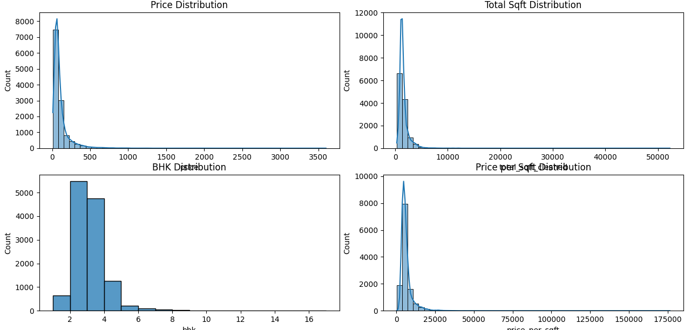
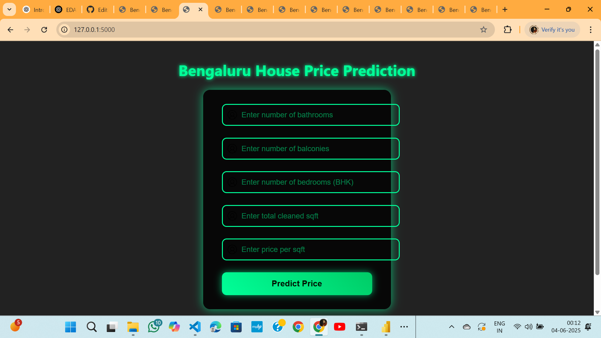

# 🏠 Bengaluru House Price Prediction

This project predicts house prices in Bengaluru using machine learning. It includes a Streamlit-based web app for interactive predictions and a Power BI dashboard for data visualization and business insights.

---

## 📁 Project Structure

- `app.py` – Streamlit web app for prediction  
- `train_and_predict.py` – Data preprocessing and model training script  
- `model.pkl` – Trained machine learning model  
- `screenshots/` – Folder containing EDA visuals, UI snapshot, and Power BI dashboard  
- `Bengaluru_House_Price_Report.pbix` – Power BI report file

---

## 📸 Screenshots

### 1. Exploratory Data Analysis (EDA)


---

### 2. Prediction Web Interface


---

### 3. Power BI Dashboard


---

## 📊 Power BI Report

Interactive Power BI report providing insights into location-wise pricing trends, BHK distribution, average prices, and more.

📎 [Download Bengaluru_House_Price_Report.pbix](Bengaluru_House_Price_Report.pbix)

---

## 🚀 How to Run the App

1. Clone this repository:
   ```bash
   git clone https://github.com/your-username/Bengaluru-House-Price-Prediction.git
   cd Bengaluru-House-Price-Prediction
Install required libraries:

pip install -r requirements.txt
Launch the Streamlit app:

streamlit run app.py
💡 Project Highlights
Real estate dataset cleaning and preprocessing

Feature engineering and outlier removal

Predictive model built using Random Forest

User-friendly UI for predictions

Power BI dashboard with key housing trends

📬 Contact
For feedback or questions, feel free to reach out:
Silla Shaju – https://www.linkedin.com/in/silla-shaju-309b66322?utm_source=share&utm_campaign=share_via&utm_content=profile&utm_medium=android_app


